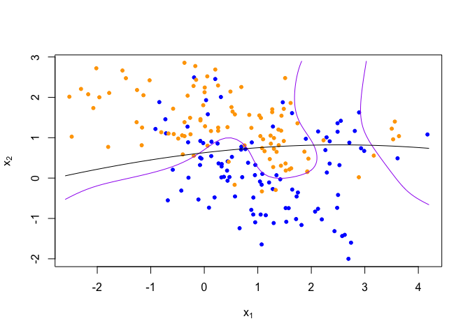
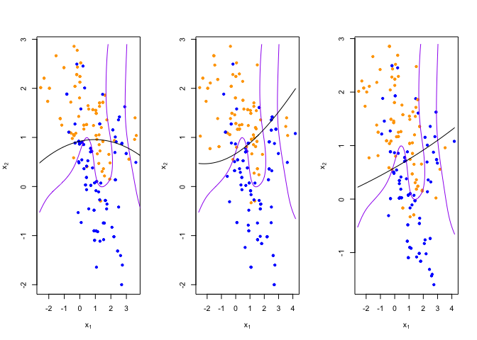

Homework 1
================
Yuning Wu
January 15, 2020

``` r
library('class')
library('dplyr')
```

    ## 
    ## Attaching package: 'dplyr'

    ## The following objects are masked from 'package:stats':
    ## 
    ##     filter, lag

    ## The following objects are masked from 'package:base':
    ## 
    ##     intersect, setdiff, setequal, union

``` r
load(url('https://web.stanford.edu/~hastie/ElemStatLearn/datasets/ESL.mixture.rda'))
dat <- ESL.mixture
```

``` r
plot_mix_data <- function(dat, datboot=NULL) {
  if(!is.null(datboot)) {
    dat$x <- datboot$x
    dat$y <- datboot$y
  }
  plot(dat$x[,1], dat$x[,2],
       col=ifelse(dat$y==0, 'blue', 'orange'),
       pch=20,
       xlab=expression(x[1]),
       ylab=expression(x[2]))
  ## draw Bayes (True) classification boundary
  prob <- matrix(dat$prob, length(dat$px1), length(dat$px2))
  cont <- contourLines(dat$px1, dat$px2, prob, levels=0.5)
  rslt <- sapply(cont, lines, col='purple')
}

plot_mix_data(dat)
```

<!-- -->

``` r
# dat <- data.frame(y = y, x = x)
# fit <- lm(y ~ x1 + x2, data = dat)
# fit

# predict(fit, data.frame(x))
```

``` r
xnew <- data.frame(dat$xnew)
colnames(xnew) <- c("x.1", "x.2")
```

``` r
## fit a linear model: formula way
fit_lc <- function(y, x) {
  # beta <- lm(y ~ x)$coefficient
  dat <- data.frame(y = y, x = x)
  fit <- lm(y ~x.1 + x.2, data = dat)
  # fit <- lm(y ~ x)
}

## make predictions from linear classifier
predict_lc <- function(x, fit) {
  # cbind(1, x) %*% beta
  predict(fit, x)
}

## fit a linear model: using lm()
fit_lc_v2 <- function(y, x) {
  # x_1_squared <- (x[,1])^2
  # x_2_squared <- (x[,2])^2
  # beta <- lm(y ~ x + x_1_squared + x_2_squared)$coefficient
  dat <- data.frame(y = y, x = x)
  fit <- lm(y ~ x.1 + x.2 + I(x.1^2) + I(x.2^2), data = dat)
}

## make predictions from linear classifier
predict_lc_v2 <- function(x, fit) {
  # x_1_squared <- (x[,1])^2
  # x_2_squared <- (x[,2])^2
  # cbind(1, x, x_1_squared, x_2_squared) %*% beta
  predict(fit, x)
}
```

``` r
lc_beta <- fit_lc(dat$y, dat$x)
lc_pred <- predict_lc(xnew, lc_beta)

lc_beta_v2 <- fit_lc_v2(dat$y, dat$x)
lc_pred_v2 <- predict_lc_v2(xnew, lc_beta_v2)
```

### original

``` r
## reshape predictions as a matrix
lc_pred <- matrix(lc_pred, length(dat$px1), length(dat$px2))
contour(lc_pred,
        xlab=expression(x[1]),
        ylab=expression(x[2]))
```

<!-- -->

``` r
## find the contours in 2D space such that lc_pred == 0.5
lc_cont <- contourLines(dat$px1, dat$px2, lc_pred, levels=0.5)

## plot data and decision surface
plot_mix_data(dat)
sapply(lc_cont, lines)
```

<!-- -->

    ## [[1]]
    ## NULL

``` r
## do bootstrap to get a sense of variance in decision surface
resample <- function(dat) {
  idx <- sample(1:length(dat$y), replace = T)
  dat$y <- dat$y[idx]
  dat$x <- dat$x[idx,]
  return(dat)
}

## plot linear classifier for three bootstraps
par(mfrow=c(1,3))
for(b in 1:3) {
  datb <- resample(dat)
  ## fit model to mixture data and make predictions
  lc_beta <- fit_lc(datb$y, datb$x)
  lc_pred_1 <- predict_lc(xnew, lc_beta)
  
  ## reshape predictions as a matrix
  lc_pred_1 <- matrix(lc_pred_1, length(datb$px1), length(datb$px2))
  
  ## find the contours in 2D space such that lc_pred_v2 == 0.5
  lc_cont <- contourLines(datb$px1, datb$px2, lc_pred_1, levels=0.5)
  
  ## plot data and decision surface
  plot_mix_data(dat, datb)
  sapply(lc_cont, lines)
}
```

<!-- -->

### with squared terms

``` r
## reshape predictions as a matrix
lc_pred_v2 <- matrix(lc_pred_v2, length(dat$px1), length(dat$px2))
contour(lc_pred_v2,
        xlab=expression(x[1]),
        ylab=expression(x[2]))
```

<!-- -->

``` r
## find the contours in 2D space such that lc_pred == 0.5
lc_cont_v2 <- contourLines(dat$px1, dat$px2, lc_pred_v2, levels=0.5)

## plot data and decision surface
plot_mix_data(dat)
sapply(lc_cont_v2, lines)
```

<!-- -->

    ## [[1]]
    ## NULL

``` r
## do bootstrap to get a sense of variance in decision surface
resample <- function(dat) {
  idx <- sample(1:length(dat$y), replace = T)
  dat$y <- dat$y[idx]
  dat$x <- dat$x[idx,]
  return(dat)
}

## plot linear classifier for three bootstraps
par(mfrow=c(1,3))
for(b in 1:3) {
  datb <- resample(dat)
  ## fit model to mixture data and make predictions
  lc_beta_v2 <- fit_lc_v2(datb$y, datb$x)
  lc_pred_v2_1 <- predict_lc_v2(xnew, lc_beta_v2)
  
  ## reshape predictions as a matrix
  lc_pred_v2_1 <- matrix(lc_pred_v2_1, length(datb$px1), length(datb$px2))
  
  ## find the contours in 2D space such that lc_pred_v2 == 0.5
  lc_cont <- contourLines(datb$px1, datb$px2, lc_pred_v2_1, levels=0.5)
  
  ## plot data and decision surface
  plot_mix_data(dat, datb)
  sapply(lc_cont, lines)
}
```

<!-- -->

The model with added squared terms returns lower bias because the
parabolas are closer to the true decision boundry which is curved. The
variance is higher because parabolas vary more from each other than
straight lines.
