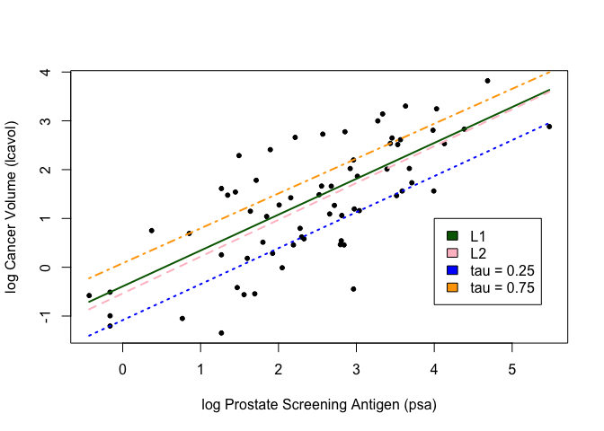
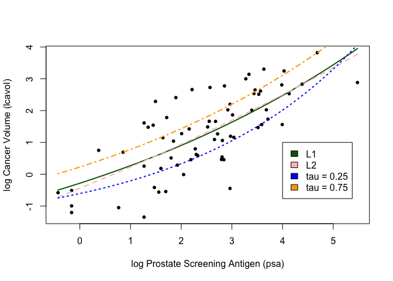

Homework 2
================
Yuning Wu
2023-01-31

``` r
## load prostate data
prostate <- 
  read.table(url(
    'https://web.stanford.edu/~hastie/ElemStatLearn/datasets/prostate.data'))

## subset to training examples
prostate_train <- subset(prostate, train==TRUE)

## plot lcavol vs lpsa
plot_psa_data <- function(dat=prostate_train) {
  plot(dat$lpsa, dat$lcavol,
       xlab="log Prostate Screening Antigen (psa)",
       ylab="log Cancer Volume (lcavol)",
       pch = 20)
}
```

``` r
############################
## regular linear regression
############################

## L1 loss function
L1_loss <- function(y, yhat)
  abs(y-yhat)

## L2 loss function
L2_loss <- function(y, yhat)
  (y-yhat)^2

## tilted absolute loss function with tau = 0.25
custom_loss_25 <- function(y, yhat)
  qrnn::tilted.abs(y-yhat, tau = 0.25)

## tilted absolute loss function with tau = 0.75
custom_loss_75 <- function(y, yhat)
  qrnn::tilted.abs(y-yhat, tau = 0.75)

## fit simple linear model using numerical optimization
fit_lin <- function(y, x, loss=L2_loss, beta_init = c(-0.51, 0.75)) {
  err <- function(beta)
    mean(loss(y,  beta[1] + beta[2]*x))
  beta <- optim(par = beta_init, fn = err)
  return(beta)
}

## make predictions from linear model
predict_lin <- function(x, beta)
  beta[1] + beta[2]*x

## fit linear model with L1 loss
lin_beta_l1 <- fit_lin(y=prostate_train$lcavol,
                    x=prostate_train$lpsa,
                    loss=L1_loss)

## fit linear model with L2 loss
lin_beta_l2 <- fit_lin(y=prostate_train$lcavol,
                    x=prostate_train$lpsa,
                    loss=L2_loss)

## fit linear model with tau = 0.25
lin_beta_custom_25 <- fit_lin(y=prostate_train$lcavol,
                    x=prostate_train$lpsa,
                    loss=custom_loss_25)

## fit linear model with tau = 0.75
lin_beta_custom_75 <- fit_lin(y=prostate_train$lcavol,
                    x=prostate_train$lpsa,
                    loss=custom_loss_75)

## compute predictions for a grid of inputs
x_grid <- seq(min(prostate_train$lpsa),
              max(prostate_train$lpsa),
              length.out=100)
lin_pred_l1 <- predict_lin(x=x_grid, beta=lin_beta_l1$par)
lin_pred_l2 <- predict_lin(x=x_grid, beta=lin_beta_l2$par)
lin_pred_custom_25 <- predict_lin(x=x_grid, beta=lin_beta_custom_25$par)
lin_pred_custom_75 <- predict_lin(x=x_grid, beta=lin_beta_custom_75$par)

## plot data
plot_psa_data()

## plot predictions
lines(x=x_grid, y=lin_pred_l1, col='darkgreen', lwd=2)
lines(x=x_grid, y=lin_pred_l2, col='pink', lwd=2, lty=2)
lines(x=x_grid, y=lin_pred_custom_25, col='blue', lwd=2, lty=3)
lines(x=x_grid, y=lin_pred_custom_75, col='orange', lwd=2, lty=4)

legend(4, 1, legend=c("L1", "L2", "tau = 0.25", "tau = 0.75"),
       fill = c("darkgreen", "pink", "blue", "orange"))
```

<!-- -->

``` r
############################
## nonlinear regression
############################

## fit simple linear model using numerical optimization
fit_nonlin <- function(y, x, loss=L2_loss, beta_init = c(-1.0, 0.0, -0.3)) {
  err <- function(beta)
    mean(loss(y,  beta[1] + beta[2]*exp(-beta[3]*x)))
  beta <- optim(par = beta_init, fn = err)
  return(beta)
}

## make predictions from linear model
predict_nonlin <- function(x, beta)
  beta[1] + beta[2]*exp(-beta[3]*x)

## fit linear model with L1 loss
nonlin_beta_l1 <- fit_nonlin(y=prostate_train$lcavol,
                    x=prostate_train$lpsa,
                    loss=L1_loss)

## fit linear model with L2 loss
nonlin_beta_l2 <- fit_nonlin(y=prostate_train$lcavol,
                    x=prostate_train$lpsa,
                    loss=L2_loss)

## fit linear model with tau = 0.25
nonlin_beta_custom_25 <- fit_nonlin(y=prostate_train$lcavol,
                    x=prostate_train$lpsa,
                    loss=custom_loss_25)

## fit linear model with tau = 0.75
nonlin_beta_custom_75 <- fit_nonlin(y=prostate_train$lcavol,
                    x=prostate_train$lpsa,
                    loss=custom_loss_75)

## compute predictions for a grid of inputs
x_grid <- seq(min(prostate_train$lpsa),
              max(prostate_train$lpsa),
              length.out=100)
nonlin_pred_l1 <- predict_nonlin(x=x_grid, beta=nonlin_beta_l1$par)
nonlin_pred_l2 <- predict_nonlin(x=x_grid, beta=nonlin_beta_l2$par)
nonlin_pred_custom_25 <- predict_nonlin(x=x_grid, beta=nonlin_beta_custom_25$par)
nonlin_pred_custom_75 <- predict_nonlin(x=x_grid, beta=nonlin_beta_custom_75$par)

## plot data
plot_psa_data()

## plot predictions
lines(x=x_grid, y=nonlin_pred_l1, col='darkgreen', lwd=2)
lines(x=x_grid, y=nonlin_pred_l2, col='pink', lwd=2, lty=2)
lines(x=x_grid, y=nonlin_pred_custom_25, col='blue', lwd=2, lty=3)
lines(x=x_grid, y=nonlin_pred_custom_75, col='orange', lwd=2, lty=4)

legend(4, 1, legend=c("L1", "L2", "tau = 0.25", "tau = 0.75"),
       fill = c("darkgreen", "pink", "blue", "orange"))
```

<!-- -->
