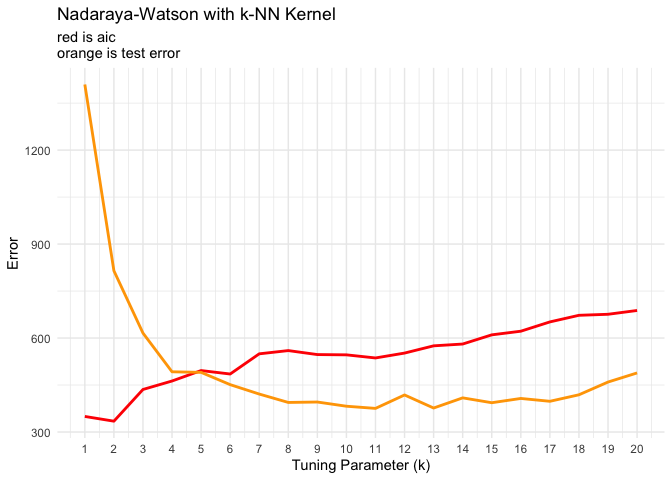

Homework_4
================
Yuning Wu
2023-02-26

``` r
library('MASS') ## for 'mcycle'
library(ggplot2)
library('caret')
```

    ## Loading required package: lattice

1.  

``` r
set.seed(1)

# 75% 25%
sample <- sample(c(TRUE, FALSE), nrow(mcycle), replace=TRUE, prob=c(0.75,0.25))
train  <- mcycle[sample, ]
test   <- mcycle[!sample, ]
```

2.  

``` r
## Make predictions using the NW method
## y  - n x 1 vector of training outputs
## x  - n x p matrix of training inputs
## x0 - m x p matrix where to make predictions
## kern  - kernel function to use
## ... - arguments to pass to kernel function
nadaraya_watson <- function(y, x, x0, kern, ...) {
  k <- t(apply(x0, 1, function(x0_) {
    k_ <- kern(x, x0_, ...)
    k_/sum(k_)
  }))
  yhat <- drop(k %*% y)
  attr(yhat, 'k') <- k
  return(yhat)
}

## k-NN kernel function
## x  - n x p matrix of training inputs
## x0 - 1 x p input where to make prediction
## k  - number of nearest neighbors
kernel_k_nearest_neighbors <- function(x, x0, k=1) {
  ## compute distance betwen each x and x0
  z <- t(t(x) - x0)
  d <- sqrt(rowSums(z*z))

  ## initialize kernel weights to zero
  w <- rep(0, length(d))
  
  ## set weight to 1 for k nearest neighbors
  w[order(d)[1:k]] <- 1
  
  return(w)
}

x_train <- matrix(train$times, length(train$times), 1)
x_test <- matrix(test$times, length(test$times), 1)
y_train <- train$accel
y_test <- test$accel
```

``` r
## Compute effective df using NW method
## y  - n x 1 vector of training outputs
## x  - n x p matrix of training inputs
## kern  - kernel function to use
## ... - arguments to pass to kernel function
effective_df <- function(y, x, kern, ...) {
  y_hat <- nadaraya_watson(y, x, x,
    kern=kern, ...)
  sum(diag(attr(y_hat, 'k')))
}

## loss function
## y    - train/test y
## yhat - predictions at train/test x
loss_squared_error <- function(y, yhat)
  (y - yhat)^2

## test/train error
## y    - train/test y
## yhat - predictions at train/test x
## loss - loss function
error <- function(y, yhat, loss=loss_squared_error)
  mean(loss(y, yhat))

## AIC
## y    - training y
## yhat - predictions at training x
## d    - effective degrees of freedom
aic <- function(y, yhat, d)
  error(y, yhat) + 2/length(y)*d

## BIC
## y    - training y
## yhat - predictions at training x
## d    - effective degrees of freedom
bic <- function(y, yhat, d)
  error(y, yhat) + log(length(y))/length(y)*d
```

``` r
k_seq <- seq(1, 20, by = 1)

train_error <- rep(0, length(k_seq))
test_error <- rep(0, length(k_seq))
edf <- rep(0, length(k_seq))
aic_list <- rep(0, length(k_seq))
bic_list <- rep(0, length(k_seq))

for (k in k_seq) {
  y_hat_train <- nadaraya_watson(y_train, x_train, x_train, kern=kernel_k_nearest_neighbors, k=k)
  train_error[k] <- error(y_train, y_hat_train)
  
  edf[k] <- effective_df(y_train, x_train, kern=kernel_k_nearest_neighbors, k=k)
  aic_list[k] <- aic(y_train, y_hat_train, edf[k])
  bic_list[k] <- bic(y_train, y_hat_train, edf[k])
  
  y_hat_test <- nadaraya_watson(y_train, x_train, x_test, kern=kernel_k_nearest_neighbors, k=k)
  test_error[k] <- error(y_test, y_hat_test)
}

df <- data.frame(k = k_seq, train_error=train_error, edf=edf, aic_list=aic_list, bic_list=bic_list, test_error=test_error)
```

3.  

``` r
ggplot(df, aes(x = k)) +
  geom_line(aes(y = train_error), color = "blue", size = 1) +
  geom_line(aes(y = aic_list), color = "red", size = 1) +
  geom_line(aes(y = bic_list), color = "green", size = 1) +
  geom_line(aes(y = test_error), color = "orange", size = 1) +
  scale_x_continuous(breaks = k_seq)+
  labs(x = "Tuning Parameter (k)",
       y = "Error",
       title = "Nadaraya-Watson with k-NN Kernel",
       subtitle = "blue is training error\nred is aic\ngreen is bic\norange is test error") +
  theme(plot.title = element_text(hjust = 0.5, size = 16),
        axis.text = element_text(size = 12),
        axis.title = element_text(size = 14))+
  theme_minimal()
```

    ## Warning: Using `size` aesthetic for lines was deprecated in ggplot2 3.4.0.
    ## ℹ Please use `linewidth` instead.

<!-- -->

``` r
ggplot(df, aes(x = k)) +
  geom_line(aes(y = train_error), color = "blue", size = 1) +
  geom_line(aes(y = test_error), color = "orange", size = 1) +
  scale_x_continuous(breaks = k_seq) +
  labs(x = "Tuning Parameter (k)",
       y = "Error",
       title = "Nadaraya-Watson with k-NN Kernel",
       subtitle = "blue is training error\norange is test error") +
  theme(plot.title = element_text(hjust = 0.5, size = 16),
        axis.text = element_text(size = 12),
        axis.title = element_text(size = 14))+
  theme_minimal()
```

<!-- -->

``` r
ggplot(df, aes(x = k)) +
  geom_line(aes(y = aic_list), color = "red", size = 1) +
  geom_line(aes(y = test_error), color = "orange", size = 1) +
  scale_x_continuous(breaks = k_seq) +
  labs(x = "Tuning Parameter (k)",
       y = "Error",
       title = "Nadaraya-Watson with k-NN Kernel",
       subtitle = "red is aic\norange is test error") +
  theme(plot.title = element_text(hjust = 0.5, size = 16),
        axis.text = element_text(size = 12),
        axis.title = element_text(size = 14))+
  theme_minimal()
```

<!-- -->

``` r
ggplot(df, aes(x = k)) +
  geom_line(aes(y = bic_list), color = "green", size = 1) +
  geom_line(aes(y = test_error), color = "orange", size = 1) +
  scale_x_continuous(breaks = k_seq) +
  labs(x = "Tuning Parameter (k)",
       y = "Error",
       title = "Nadaraya-Watson with k-NN Kernel",
       subtitle = "green is bic\norange is test error") +
  theme(plot.title = element_text(hjust = 0.5, size = 16),
        axis.text = element_text(size = 12),
        axis.title = element_text(size = 14))+
  theme_minimal()
```

<!-- -->

4.  

``` r
## 5-fold cross-validation of knnreg model
## create five folds
set.seed(1985)
mcycle_flds  <- createFolds(mcycle$accel, k=5)
print(mcycle_flds)
```

    ## $Fold1
    ##  [1]   8  21  25  26  28  31  35  39  41  42  65  69  71  73  77  80  88  98 101
    ## [20] 102 108 109 116 128 129 130
    ## 
    ## $Fold2
    ##  [1]  11  12  15  16  17  23  32  44  47  49  51  55  57  68  75  79  82  90  92
    ## [20]  99 107 110 113 117 119 121 123 125
    ## 
    ## $Fold3
    ##  [1]   2  10  18  19  34  36  38  45  46  50  54  58  63  64  81  84  85  86  87
    ## [20]  89  93  97 115 118 124 132
    ## 
    ## $Fold4
    ##  [1]   3   6   7  14  20  24  27  29  33  40  43  48  56  59  60  66  74  78  91
    ## [20]  94  96 104 106 122 126 127 131
    ## 
    ## $Fold5
    ##  [1]   1   4   5   9  13  22  30  37  52  53  61  62  67  70  72  76  83  95 100
    ## [20] 103 105 111 112 114 120 133

``` r
sapply(mcycle_flds, length)  ## not all the same length
```

    ## Fold1 Fold2 Fold3 Fold4 Fold5 
    ##    26    28    26    27    26

``` r
cvknnreg <- function(kNN = 10, flds=mcycle_flds) {
  cverr <- rep(NA, length(flds))
  for(tst_idx in 1:length(flds)) { ## for each fold
    
    ## get training and testing data
    mycycle_trn <- mcycle[-flds[[tst_idx]],]
    mycycle_tst <- mcycle[ flds[[tst_idx]],]
    
    ## fit kNN model to training data
    knn_fit <- knnreg(accel ~ times,
                      k=kNN, data=mycycle_trn)
    
    ## compute test error on testing data
    pre_tst <- predict(knn_fit, mycycle_tst)
    cverr[tst_idx] <- mean((mycycle_tst$accel - pre_tst)^2)
  }
  return(cverr)
}

## Compute 5-fold CV for kNN = 1:20
cverrs <- sapply(1:20, cvknnreg)
print(cverrs) ## rows are k-folds (1:5), cols are kNN (1:20)
```

    ##           [,1]      [,2]      [,3]      [,4]      [,5]     [,6]     [,7]
    ## [1,] 1662.9777 1200.0656 1140.7323 1139.9682 1072.4565 871.8225 902.6736
    ## [2,] 1233.9254  719.7545  414.6529  406.2720  392.1644 388.9737 356.7845
    ## [3,]  950.2992  743.4935  767.2904  790.7059  837.1636 746.2646 699.6566
    ## [4,] 1066.6833  939.3517  966.4693  819.2197  762.0736 739.3821 755.9211
    ## [5,]  829.5536  866.2058  847.8847  786.1484  698.5016 718.3772 647.9664
    ##          [,8]     [,9]    [,10]    [,11]    [,12]    [,13]    [,14]    [,15]
    ## [1,] 865.9440 881.9663 905.4154 918.8290 879.4212 870.7356 893.7753 948.6905
    ## [2,] 398.2982 437.8430 435.3835 468.2931 458.9995 420.2574 406.9754 374.1702
    ## [3,] 665.1589 684.4300 707.7291 699.0208 723.3589 726.6567 696.9062 714.1368
    ## [4,] 773.0690 753.5173 732.2657 693.2659 707.9107 712.3221 680.9196 676.9464
    ## [5,] 654.7812 582.7061 580.6095 591.8443 580.9938 586.1192 588.1546 575.1274
    ##         [,16]    [,17]    [,18]    [,19]    [,20]
    ## [1,] 923.3845 940.7557 996.8310 952.1598 965.4597
    ## [2,] 382.4026 405.5556 419.2063 417.0465 417.9231
    ## [3,] 767.9444 755.3994 754.1490 781.4413 868.3828
    ## [4,] 678.1938 684.7731 737.2583 773.9589 840.3452
    ## [5,] 600.3366 618.1128 656.5049 666.6291 688.6101

``` r
cverrs_mean <- apply(cverrs, 2, mean)
cverrs_sd   <- apply(cverrs, 2, sd)
```

5.  

``` r
## Plot the results of 5-fold CV for kNN = 1:20
plot(x=1:20, y=cverrs_mean, 
     ylim=range(cverrs),
     xlab="'k' in kNN", ylab="CV Estimate of Test Error")
segments(x0=1:20, x1=1:20,
         y0=cverrs_mean-cverrs_sd,
         y1=cverrs_mean+cverrs_sd)
best_idx <- which.min(cverrs_mean)
points(x=best_idx, y=cverrs_mean[best_idx], pch=20)
abline(h=cverrs_mean[best_idx] + cverrs_sd[best_idx], lty=3)
```

<!-- -->

6.  `k = 14` is the best parameter for the Nadaraya-Watson method with
    the k-NN kernel function according the parcemonain rule.
