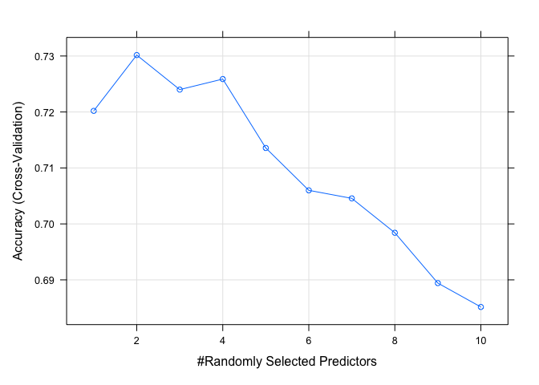

Homework_5
================
Yuning Wu
2023-04-04

``` r
library('randomForest')  ## fit random forest
```

    ## randomForest 4.7-1.1

    ## Type rfNews() to see new features/changes/bug fixes.

``` r
library('dplyr')    ## data manipulation
```

    ## 
    ## Attaching package: 'dplyr'

    ## The following object is masked from 'package:randomForest':
    ## 
    ##     combine

    ## The following objects are masked from 'package:stats':
    ## 
    ##     filter, lag

    ## The following objects are masked from 'package:base':
    ## 
    ##     intersect, setdiff, setequal, union

``` r
library('magrittr') ## for '%<>%' operator
library('gpairs')   ## pairs plot
library('viridis')  ## viridis color palette
```

    ## Loading required package: viridisLite

``` r
library("tidyverse")
```

    ## ── Attaching packages
    ## ───────────────────────────────────────
    ## tidyverse 1.3.2 ──

    ## ✔ ggplot2 3.4.0     ✔ purrr   1.0.1
    ## ✔ tibble  3.1.8     ✔ stringr 1.5.0
    ## ✔ tidyr   1.2.1     ✔ forcats 0.5.1
    ## ✔ readr   2.1.2     
    ## ── Conflicts ────────────────────────────────────────── tidyverse_conflicts() ──
    ## ✖ dplyr::combine()   masks randomForest::combine()
    ## ✖ tidyr::extract()   masks magrittr::extract()
    ## ✖ dplyr::filter()    masks stats::filter()
    ## ✖ dplyr::lag()       masks stats::lag()
    ## ✖ ggplot2::margin()  masks randomForest::margin()
    ## ✖ purrr::set_names() masks magrittr::set_names()

``` r
library("caret")
```

    ## Loading required package: lattice
    ## 
    ## Attaching package: 'caret'
    ## 
    ## The following object is masked from 'package:purrr':
    ## 
    ##     lift

``` r
vowel_train <- 
  read_csv(url(
    'https://hastie.su.domains/ElemStatLearn/datasets/vowel.train'))
```

    ## Rows: 528 Columns: 12
    ## ── Column specification ────────────────────────────────────────────────────────
    ## Delimiter: ","
    ## dbl (12): row.names, y, x.1, x.2, x.3, x.4, x.5, x.6, x.7, x.8, x.9, x.10
    ## 
    ## ℹ Use `spec()` to retrieve the full column specification for this data.
    ## ℹ Specify the column types or set `show_col_types = FALSE` to quiet this message.

``` r
vowel_train <- vowel_train %>% 
  mutate(y = as.factor(y)) %>% 
  select(- row.names)
```

``` r
fit <- randomForest(y ~ ., data=vowel_train)
```

``` r
set.seed(1985)
vowel_flds  <- createFolds(vowel_train$y, k=5)
print(vowel_flds)
```

    ## $Fold1
    ##   [1]   2   8  13  18  20  24  27  28  32  38  39  51  52  56  69  84  87  88
    ##  [19]  96  97 100 102 108 110 115 118 119 134 143 146 150 151 156 164 182 190
    ##  [37] 191 193 199 202 204 209 231 236 240 243 247 264 268 270 275 279 281 282
    ##  [55] 287 289 299 307 309 311 314 325 345 346 348 349 351 354 356 361 362 370
    ##  [73] 379 381 382 395 399 406 408 415 416 417 418 422 435 436 438 452 453 454
    ##  [91] 455 460 463 466 473 478 481 487 489 492 497 504 505 513 517
    ## 
    ## $Fold2
    ##   [1]   3   4   7   9  19  23  43  46  49  60  62  63  89  90  92  93 103 105
    ##  [19] 120 122 125 126 130 132 135 137 142 148 149 154 155 158 161 167 170 174
    ##  [37] 177 205 206 207 213 215 218 219 220 222 225 229 230 233 239 242 249 256
    ##  [55] 258 259 265 272 274 277 278 283 285 290 293 294 300 312 316 327 328 331
    ##  [73] 332 334 352 353 358 359 363 366 371 373 377 380 394 405 413 442 444 451
    ##  [91] 458 461 464 469 479 482 484 496 498 507 509 516 523 528
    ## 
    ## $Fold3
    ##   [1]  11  12  16  17  21  37  40  42  48  50  54  61  73  74  76  78  79  82
    ##  [19]  85  94 109 112 121 129 136 138 141 144 152 159 165 166 168 172 173 178
    ##  [37] 179 183 185 192 195 197 201 212 228 234 237 253 255 266 267 280 286 288
    ##  [55] 296 301 303 313 315 317 320 323 326 329 330 333 335 339 342 344 350 364
    ##  [73] 365 368 374 378 386 391 393 398 411 412 414 419 420 431 432 441 443 445
    ##  [91] 448 449 462 471 477 480 483 488 490 491 495 514 524 525 526 527
    ## 
    ## $Fold4
    ##   [1]   1   5   6  15  26  29  33  34  35  36  45  47  53  55  65  66  68  71
    ##  [19]  80  91 111 113 114 123 124 128 131 139 140 145 153 157 163 169 171 186
    ##  [37] 187 198 200 203 216 217 221 223 224 226 235 246 250 251 254 260 261 262
    ##  [55] 263 284 291 297 304 305 308 310 318 319 321 337 338 340 341 347 357 360
    ##  [73] 372 383 392 400 401 402 404 409 410 424 426 427 428 430 434 440 446 447
    ##  [91] 450 456 457 467 468 472 474 476 485 499 502 508 510 512 515 519 522
    ## 
    ## $Fold5
    ##   [1]  10  14  22  25  30  31  41  44  57  58  59  64  67  70  72  75  77  81
    ##  [19]  83  86  95  98  99 101 104 106 107 116 117 127 133 147 160 162 175 176
    ##  [37] 180 181 184 188 189 194 196 208 210 211 214 227 232 238 241 244 245 248
    ##  [55] 252 257 269 271 273 276 292 295 298 302 306 322 324 336 343 355 367 369
    ##  [73] 375 376 384 385 387 388 389 390 396 397 403 407 421 423 425 429 433 437
    ##  [91] 439 459 465 470 475 486 493 494 500 501 503 506 511 518 520 521

``` r
sapply(vowel_flds, length)
```

    ## Fold1 Fold2 Fold3 Fold4 Fold5 
    ##   105   104   106   107   106

``` r
cv_control <- trainControl(method = "cv", index = vowel_flds)

# Define grid of hyperparameters to tune
param_grid <- expand.grid(mtry = c(1:10))
```

``` r
model <- train(y ~ ., data = vowel_train, method = "rf",
               tuneGrid = param_grid, trControl = cv_control)

print(model)
```

    ## Random Forest 
    ## 
    ## 528 samples
    ##  10 predictor
    ##  11 classes: '1', '2', '3', '4', '5', '6', '7', '8', '9', '10', '11' 
    ## 
    ## No pre-processing
    ## Resampling: Cross-Validated (10 fold) 
    ## Summary of sample sizes: 105, 104, 106, 107, 106 
    ## Resampling results across tuning parameters:
    ## 
    ##   mtry  Accuracy   Kappa    
    ##    1    0.7201975  0.6922148
    ##    2    0.7301670  0.7031823
    ##    3    0.7239991  0.6963993
    ##    4    0.7258803  0.6984698
    ##    5    0.7135681  0.6849259
    ##    6    0.7059986  0.6765930
    ##    7    0.7045611  0.6750138
    ##    8    0.6984167  0.6682581
    ##    9    0.6894221  0.6583593
    ##   10    0.6851566  0.6536700
    ## 
    ## Accuracy was used to select the optimal model using the largest value.
    ## The final value used for the model was mtry = 2.

``` r
print(model$results)
```

    ##    mtry  Accuracy     Kappa AccuracySD    KappaSD
    ## 1     1 0.7201975 0.6922148 0.02918518 0.03209026
    ## 2     2 0.7301670 0.7031823 0.04323324 0.04754147
    ## 3     3 0.7239991 0.6963993 0.03488601 0.03836251
    ## 4     4 0.7258803 0.6984698 0.02432348 0.02674731
    ## 5     5 0.7135681 0.6849259 0.03023637 0.03325352
    ## 6     6 0.7059986 0.6765930 0.02716640 0.02987663
    ## 7     7 0.7045611 0.6750138 0.03080790 0.03387811
    ## 8     8 0.6984167 0.6682581 0.03374342 0.03709840
    ## 9     9 0.6894221 0.6583593 0.03615437 0.03976037
    ## 10   10 0.6851566 0.6536700 0.03406862 0.03746869

``` r
print(model$bestTune)
```

    ##   mtry
    ## 2    2

``` r
plot(model)
```

<!-- -->

``` r
vowel_test <- 
  read_csv(url(
    'https://hastie.su.domains/ElemStatLearn/datasets/vowel.test'))
```

    ## Rows: 462 Columns: 12
    ## ── Column specification ────────────────────────────────────────────────────────
    ## Delimiter: ","
    ## dbl (12): row.names, y, x.1, x.2, x.3, x.4, x.5, x.6, x.7, x.8, x.9, x.10
    ## 
    ## ℹ Use `spec()` to retrieve the full column specification for this data.
    ## ℹ Specify the column types or set `show_col_types = FALSE` to quiet this message.

``` r
vowel_test <- vowel_test %>% 
  mutate(y = as.factor(y)) %>% 
  select(- row.names)
```

``` r
preds <- predict(model, newdata = vowel_test)
cm <- confusionMatrix(preds, vowel_test$y)
cm
```

    ## Confusion Matrix and Statistics
    ## 
    ##           Reference
    ## Prediction  1  2  3  4  5  6  7  8  9 10 11
    ##         1  33  0  0  0  0  0  0  0  0  3  0
    ##         2   8 24  2  0  0  0  1  0  1 17  1
    ##         3   1 14 32  3  0  1  0  0  0  0  1
    ##         4   0  0  2 30  3  0  0  0  0  0  2
    ##         5   0  0  0  0 17  9 10  0  0  0  0
    ##         6   0  0  5  9 18 23  3  0  0  0  6
    ##         7   0  0  0  0  3  0 27  7  4  0  3
    ##         8   0  0  0  0  0  0  0 29  6  0  0
    ##         9   0  4  0  0  0  0  1  5 24  1 12
    ##         10  0  0  0  0  0  0  0  1  2 21  0
    ##         11  0  0  1  0  1  9  0  0  5  0 17
    ## 
    ## Overall Statistics
    ##                                           
    ##                Accuracy : 0.5996          
    ##                  95% CI : (0.5533, 0.6446)
    ##     No Information Rate : 0.0909          
    ##     P-Value [Acc > NIR] : < 2.2e-16       
    ##                                           
    ##                   Kappa : 0.5595          
    ##                                           
    ##  Mcnemar's Test P-Value : NA              
    ## 
    ## Statistics by Class:
    ## 
    ##                      Class: 1 Class: 2 Class: 3 Class: 4 Class: 5 Class: 6
    ## Sensitivity           0.78571  0.57143  0.76190  0.71429  0.40476  0.54762
    ## Specificity           0.99286  0.92857  0.95238  0.98333  0.95476  0.90238
    ## Pos Pred Value        0.91667  0.44444  0.61538  0.81081  0.47222  0.35938
    ## Neg Pred Value        0.97887  0.95588  0.97561  0.97176  0.94131  0.95226
    ## Prevalence            0.09091  0.09091  0.09091  0.09091  0.09091  0.09091
    ## Detection Rate        0.07143  0.05195  0.06926  0.06494  0.03680  0.04978
    ## Detection Prevalence  0.07792  0.11688  0.11255  0.08009  0.07792  0.13853
    ## Balanced Accuracy     0.88929  0.75000  0.85714  0.84881  0.67976  0.72500
    ##                      Class: 7 Class: 8 Class: 9 Class: 10 Class: 11
    ## Sensitivity           0.64286  0.69048  0.57143   0.50000   0.40476
    ## Specificity           0.95952  0.98571  0.94524   0.99286   0.96190
    ## Pos Pred Value        0.61364  0.82857  0.51064   0.87500   0.51515
    ## Neg Pred Value        0.96411  0.96956  0.95663   0.95205   0.94172
    ## Prevalence            0.09091  0.09091  0.09091   0.09091   0.09091
    ## Detection Rate        0.05844  0.06277  0.05195   0.04545   0.03680
    ## Detection Prevalence  0.09524  0.07576  0.10173   0.05195   0.07143
    ## Balanced Accuracy     0.80119  0.83810  0.75833   0.74643   0.68333

``` r
misclassification_rate <- 1- cm$overall["Accuracy"]
cat("Misclassifcation rate = ", misclassification_rate)
```

    ## Misclassifcation rate =  0.4004329
